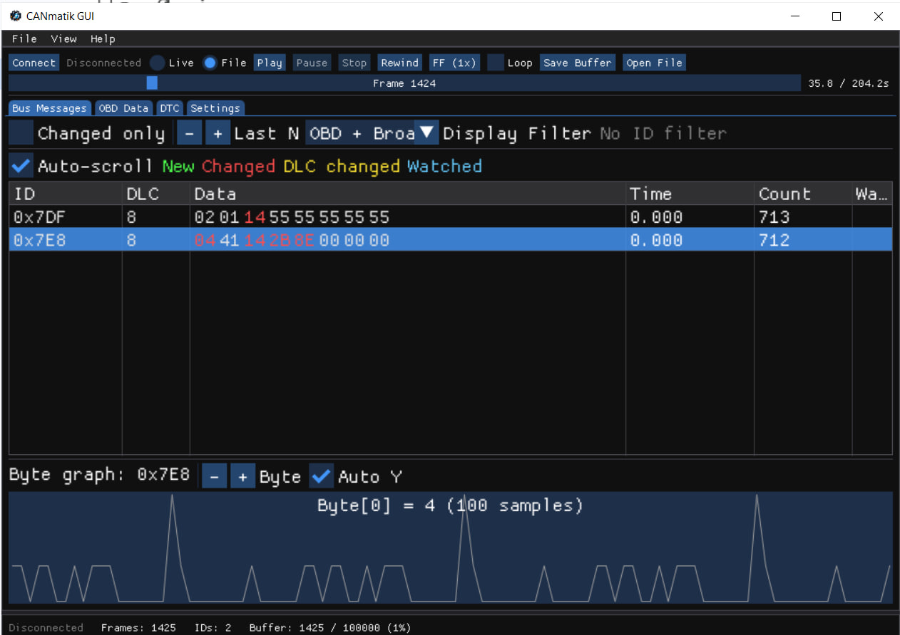
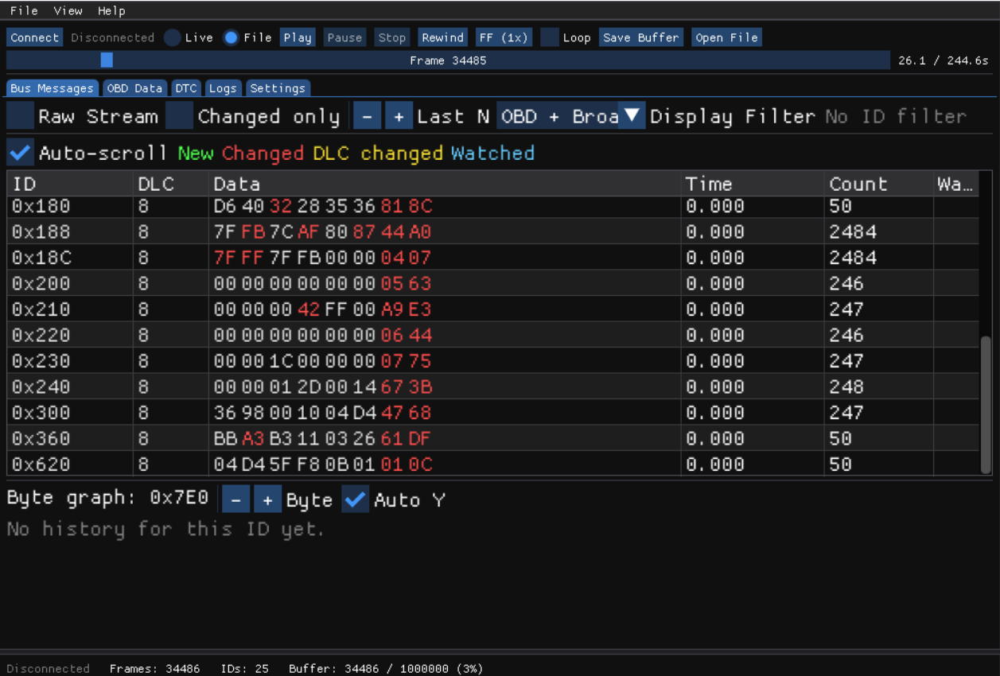
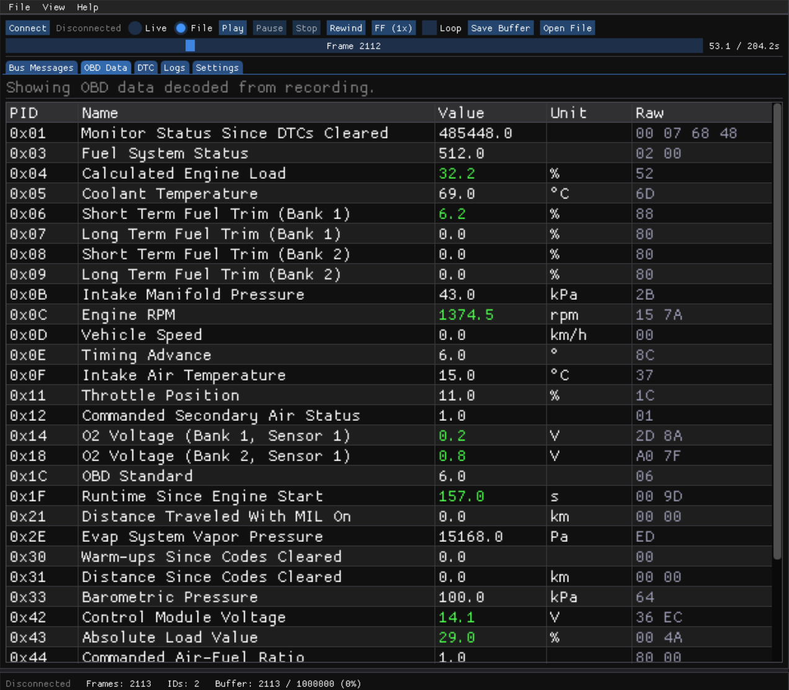
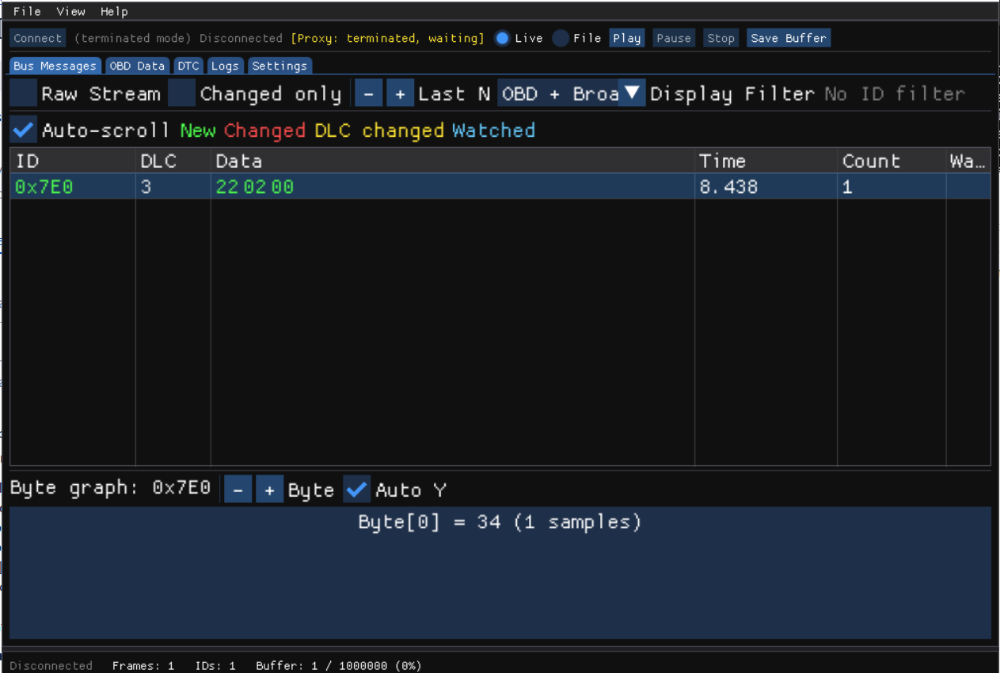

# CANmatik — J2534 CAN Bus Scanner, Logger & OBD-II Diagnostics

An open-source desktop tool that connects to vehicles via a USB J2534 Pass-Thru
adapter, captures CAN bus traffic in real time, decodes OBD-II diagnostic data,
and saves sessions for later analysis.



> **Safety**: CANmatik defaults to **passive monitoring mode**. OBD-II queries
> are the only active transmissions, and destructive operations (e.g., DTC
> clearing) require explicit `--force` confirmation. See [SAFETY.md](SAFETY.md)
> for details.

## Features

### GUI — Primary Interface

CANmatik is a single `canmatik.exe` binary. Double-click it to launch the
graphical interface. The GUI provides:

- **CAN Messages** — live table grouped by sender ID with byte-level diff
  highlighting, DLC change detection, and per-byte color coding
- **Raw Stream** — chronological view of every frame as it arrives on the bus
- **Watchdog** — pin specific CAN IDs, decode byte ranges with linear formulas,
  and plot values over time
- **OBD-II** — query supported PIDs, stream live engine data, read/clear DTCs,
  retrieve VIN and ECU info
- **Recording & Replay** — capture sessions to ASC or JSONL, replay them offline
  with playback controls (play/pause/seek/loop/speed)
- **J2534 Proxy** — intercept J2534 calls from third-party diagnostic tools and
  display traffic in real time, with a terminated mode for monitoring without
  hardware
- **Settings** — adapter selection, bitrate, buffer size, color scheme, font
  scaling, OBD PID configuration





### CLI — Scripting & Automation

When invoked with command-line arguments, `canmatik.exe` runs in CLI mode
(attaches to the parent console automatically):

```powershell
canmatik.exe scan                    # discover J2534 providers
canmatik.exe monitor --mock          # display live CAN frames
canmatik.exe record -o session.asc   # record to file
canmatik.exe replay session.asc      # replay offline
canmatik.exe obd stream              # stream OBD-II data
canmatik.exe obd dtc                 # read trouble codes
```

All commands support `--json` for machine-readable output, `--mock` for
hardware-free testing, and `--verbose`/`--debug` for diagnostics.

### J2534 Proxy

CANmatik can register itself as a J2534 provider in Windows, intercepting calls
from other diagnostic tools (e.g., ROM editors, ECU flashers) and displaying
the captured traffic in the GUI.



## Prerequisites

- Windows 10 or later (64-bit OS, 32-bit application)
- A USB J2534-compatible adapter (e.g., Tactrix OpenPort 2.0 J2534 ISO/CAN/VPW/PWM) with its
  driver/provider installed

### Building from Source

- [MSYS2](https://www.msys2.org/) with the **i686** (32-bit) MinGW toolchain:

```bash
pacman -S mingw-w64-i686-gcc mingw-w64-i686-cmake mingw-w64-i686-ninja
```

- Git (for cloning and submodules)
- [Inno Setup 6](https://jrsoftware.org/isinfo.php) (optional, for building the
  installer)

## Build

```powershell
git clone --recursive https://github.com/<org>/canmatik.git
cd canmatik

cmake -B build32 -G Ninja -DCMAKE_BUILD_TYPE=Release
cmake --build build32

# Run tests (213 tests)
cd build32 && ctest --output-on-failure && cd ..
```

### Build Installer

After building, generate the installer with Inno Setup:

```powershell
& "C:\Program Files (x86)\Inno Setup 6\ISCC.exe" installer\canmatik.iss
```

The installer is written to `installer\Output\canmatik-0.1.0-setup.exe`.

## Quick Start

1. **Run** `canmatik.exe` — the GUI opens
2. **Select** your J2534 adapter in the Settings tab
3. **Connect** — CAN frames appear in the Bus Messages tab
4. **Switch** to the OBD tab for live engine data and DTCs
5. **Record** sessions via the menu bar or `canmatik.exe record` from the
   command line

For detailed usage, see [docs/user-guide.md](docs/user-guide.md).

## Project Structure

```
src/
├── core/          # Platform-agnostic domain (CanFrame, FilterEngine, Result<T>)
├── transport/     # IDeviceProvider / IChannel interfaces
├── platform/      # Windows J2534 implementation
├── mock/          # Mock backend for testing and demo
├── services/      # CaptureService, RecordService, ReplayService
├── logging/       # ASC and JSONL writers/readers
├── obd/           # OBD-II: PID tables, decoders, ISO-TP, session, scheduler
├── proxy/         # J2534 proxy server + fake DLL
├── cli/           # CLI frontend (CLI11)
├── gui/           # ImGui frontend (Win32 + OpenGL3)
│   ├── panels/    # CAN messages, OBD, settings, watchdog, logs
│   └── controllers/  # Capture, replay, OBD controllers
├── fake_j2534/    # Interceptor DLL deployed as J2534 provider
└── config/        # Configuration loading
third_party/
├── tinylog/       # Diagnostic logger (git submodule)
├── imgui/         # Dear ImGui (git submodule)
└── CMakeLists.txt # Builds vendored deps as static libraries
tests/
├── unit/          # Catch2 unit tests (179 tests)
└── integration/   # End-to-end tests with mock backend (34 tests)
installer/
└── canmatik.iss   # Inno Setup installer script
```

## Technology

| Component | Choice |
|-----------|--------|
| Language | C++20 (GCC ≥ 13) |
| Build | CMake ≥ 3.24, Ninja |
| Target | Windows 10+, 32-bit (for J2534 DLL compatibility) |
| GUI | Dear ImGui (Win32 + OpenGL3) |
| CLI | CLI11 2.4 |
| JSON | nlohmann/json 3.11 |
| YAML | yaml-cpp 0.8 (OBD config) |
| Testing | Catch2 v3 (213 tests) |
| Logging | TinyLog (git submodule) |
| Log formats | Vector ASC, JSON Lines |
| Installer | Inno Setup 6 |

## Exit Codes

| Code | Meaning |
|------|---------|
| 0 | Success |
| 1 | User error (bad arguments, invalid config) |
| 2 | Hardware/runtime failure |

## Contributing

See [CONTRIBUTING.md](CONTRIBUTING.md) for development setup, coding standards,
and the pull request workflow.

## License

TBD
